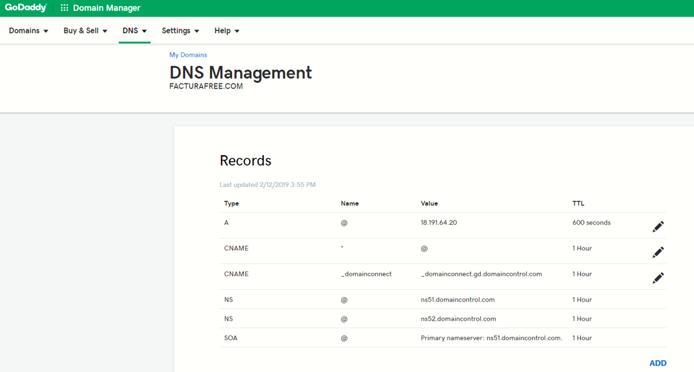

# Requisitos Previos

 1. Tener acceso a su servidor, vps, máquina virtual o local via SSH, en las instalaciones que realizamos para AWS o Google Cloud, hacemos entrega del usuario, la IP del servidor y la clave ssh que puede ser un archivo .ppk o .pem

 2.	Tener instalado una versión de ssh en su máquina para conectarse de manera remota, puede utilizar putty, filezilla o una consola terminal.

 3.	Es importante configurar su dominio apuntando a la IP de su instancia para que durante la ejecución del script se valide el certificado SSL y al finalizar la ejecución no tenga errores y todo esté listo para realizar pruebas. Edite los récords A y CNAME donde A debe contener su IP y CNAME el valor * (asterisco) para que se tomen los subdominios registrados por la herramienta.

4. Durante la ejecución del script deberá almacenar en su dominio dos registros TXT con unos valores que se mostrarán en pantalla, estos registros son validados en directo y no pueden tardar más de 2 minutos en validarse en su dominio.

5.	En caso de contar con servicios instalados en su instancia como mysql, apache o nginx, debe detenerlos, ya que estos ocupan los puertos que pasarán a usarse con el aplicativo y los contenedores de Docker.
