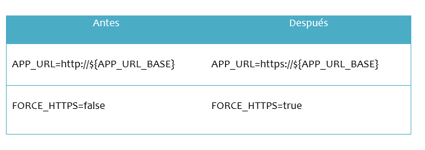

# Pasos de Instalacin

- Para instalar debe ejecutar el script evitando instalar el SSL, le será consultado en el proceso y deberá ingresar `"n"`.

 - Finalizada la instalación debe dirigirse a la ruta de instalación:
```bash
cd /root/facturadorpro31/
```
- Debe editar el archivo `.env`

```bash
nano .env
```

Dentro del editor ubicar los parámetros y cambiarlos:




- Una vez finalizado, guarde y salga del editor.

- Ejecute los siguientes comandos para eliminar la caché de la aplicación.

```bash
php artisan config:Cache
```

- Con eso habrá completado el lado de la herramienta, en ese momento hasta no tener un SSL configurado no podrá acceder a la herramienta.

# Importante
- Recuerde habilitar el puerto 443 para poder tener acceso a la herramienta
