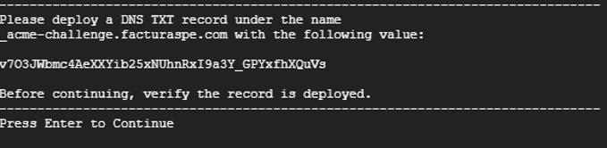
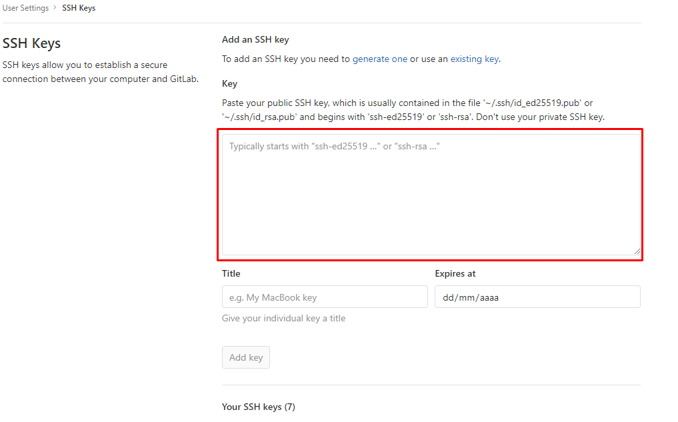

# Manual de Instalación

**1.** Acceder a su instancia via SSH.

**2.** Loguearse como super usuario ejecute **sudo su**.

**3.** Clonar el snippet de gitlab que contiene el script git clone `https://gitlab.com/snippets/2079063.git` script

**4.** Ingrese a la carpeta clonada

```bash
cd script
```

**5.** Dar permisos de ejecución al script

```bash
chmod +x install.sh
```
 
**6.** El comando a utilizar para iniciar el despliegue requiere de un parámetro principalmente:

```bash
./install.sh [dominio]
```

**por ejemplo:**

```bash
./install.sh facturador.pro
```

**7.** Una vez ejecutado el comando iniciará el proceso de actualización del sistema, en el proceso se le solicitará:

- El usuario y contraseña de GitLab, para que se pueda descargar el proyecto en su instancia.

- Si desea instalar SSL gratuito, tenga en cuenta que este debe ser actualizado cada 90 días, el mensaje será el siguiente:

```bash
instalar con SSL? (debe tener acceso al panel de su dominio para editar/agregar records TXT). si[s] no[n]
```
> 1.   Deberá contestar con “s” o “n” para continuar
> 2.   Si selecciona `SÍ`, deberá contestar las siguientes preguntas con “y”, son 2 en total, seguidamente se le ofrecerá un código que debe añadir en un récord tipo TXT en su dominio quedando como `_acme-challenge.example.com` o simplemente `_acme-challenge` dependerá de su proveedor.



> 3.   Para continuar presione enter, luego deberá repetir las acciones para añadir un segundo código y habrá finalizado la configuración, si el proceso es exitoso la ejecución del script continuará.


- Si desea obtener y gestionar actualizaciones automáticas, deberá disponer de su sesión de gitlab al momento

```bash
configurar clave SSH para actualización automática? (requiere acceso a https://gitlab.com/profile/keys). si[s] no[n]
```
> 1. Deberá contestar con “s” o “n” para continuar de seleccionar SÍ, al final del despliegue se le dará un extracto de texto que debe añadir a su configuración de gitlab



**8.** Finalizado el script y dependiendo de sus selecciones anteriores, se le entregará varios datos que debe guardar, como:
- Usuario administrador
- Contraseña para usuario administrador
- Url del proyecto
- Ubicación del proyecto dentro del servidor
- Clave ssh para añadir a gitlab (obligatorio para quienes seleccionan la instalación de SSH)