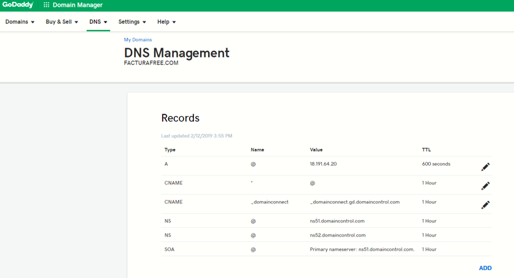

# Requisitos Previos

 1.   Tener acceso a su servidor, vps, máquina virtual o local via SSH, en las instalaciones que realizamos para AWS o Google Cloud, hacemos entrega del usuario, la IP del servidor y la clave ssh que puede ser un archivo .ppk o .pem, recuerde almacenarlas en su equipo local.

 2.	Tener instalado una versión de ssh en su máquina para conectarse de manera remota, puede utilizar putty, filezilla o una consola terminal. para mayor información sobre el acceso SSH visite los siguientes manuales: 
 -  [Guía para acceder con Putty (gestión de servidor)](https://support.google.com/drive/answer/6283888)
 -  [Guía para acceder con Winscp (gestión de archivos con aplicación de escritorio)](https://support.google.com/drive/answer/6283888)

 3.	Si es posible configurar su dominio apuntando a su instancia para que al finalizar la instalación se encuentre disponible el aplicativo. Edite los récords A y CNAME donde A debe contener su IP y CNAME el valor * (asterisco) para que se tomen los subdominios registrados por la herramienta.

4. En caso de contar con servicios instalados en su instancia como mysql, apache o nginx, debe detenerlos, ya que estos ocupan los puertos que pasarán a usar el aplicativo con los contenedores de Docker.